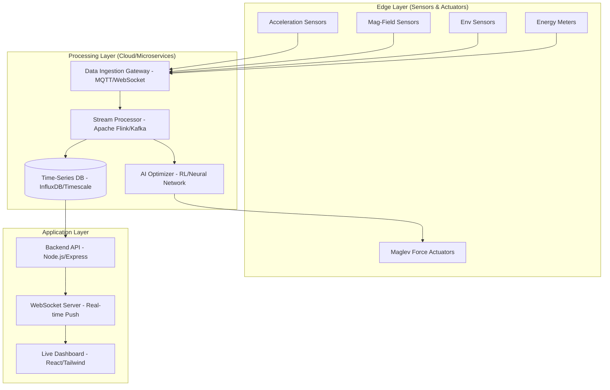

# Implementation Plan: Maglev Control & Real-time Monitoring System

This document outlines the architecture, data flow, and implementation strategy for the real-time Maglev monitoring and control system.

## 1. System Architecture Diagram

## 2. Real-time Data Flow & Decision-making

1.  **Ingestion**: Sensors broadcast raw telemetry (PCM/JSON) via MQTT or high-speed WebSockets.
2.  **Streaming**: The Stream Processor filters noise and calculates derived metrics (e.g., instantaneous lift force).
3.  **AI Optimization**:
    *   The **AI Model** receives current state (gap distance, acceleration, current).
    *   Predicts the next optimal force level to maintain stability.
    *   Sends control signals back to actuators with <10ms latency.
4.  **Persistence**: Data is indexed in a time-series database for historical analysis and simulation comparison.
5.  **Visualization**: The Frontend subscribes to a WebSocket channel to update charts and gauges in real-time.

## 3. Testing Strategy & Deployment Pipeline

### Automated Testing Pipelines
*   **Unit Testing**: Vitest for frontend components and backend logic.
*   **Integration Testing**: Simulating sensor input streams to verify AI response latency.
*   **Stress Testing**: High-frequency data bursts (1000+ msgs/sec) to test backend scalability.
*   **Simulation-based Validation**: Digital Twin simulation to compare 'Predicted Stability' vs 'Actual Drift'.

### Deployment (CI/CD)
*   **GitHub Actions**: Triggering tests on every push.
*   **Containerization**: Dockerizing microservices for consistent deployment.
*   **Cloud Hosting**: Deploying to AWS/Azure with auto-scaling groups for the processing layer.

## 4. Sample Dashboard Visualization Concept

| Component | Description | Visualization Type |
| :--- | :--- | :--- |
| **Lift Force Monitor** | Real-time vertical force vs. target setpoint. | Multi-line Live Chart |
| **System Stability** | AI-calculated stability score (0-100%). | Radial Gauge |
| **Energy Efficiency** | Power usage per unit of lift force. | Area Chart |
| **Anomaly Detection** | Alerts for magnetic field fluctuations or overheating. | Real-time Alert Feed |
| **Simulation Overlay** | Comparing real-time data against a theoretical physics model. | Dual-axis Chart |

## 5. Next Steps
1.  **Define Types**: Update `shared/api.ts` with sensor and control interfaces.
2.  **Backend Implementation**: Setup WebSocket server and simulated data bridge.
3.  **Frontend Implementation**: Create the 'Maglev Dashboard' page with real-time components.
4.  **AI Integration**: Implement a simplified RL-based optimization stub.
